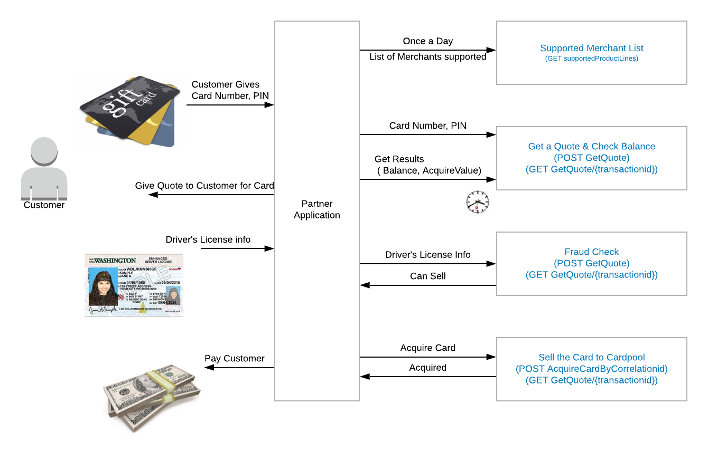

# How it Works
4 Easy steps for purchasing gift cards from your customers.

There are four basic steps for selling a card to Cardpool:

## Step 1: Download the merchants supported by Cardpool (Required)

We recommend a once a day download of the list of merchants supported by Cardpool. The merchant list includes the merchant name, the price that Cardpool is willing to pay, the lower and upper limit of the card values we can accept. The details of the call can be reviewed here.

## Step 2: Get a Quote for a card (Required)
Getting a 'quote' involves checking the balance on the card and making sure the card is acceptable and is not a Merchant Return Credit Card. Cardpool may not accept the gift card at this step.

This step can take the longest, and we make sure the card itself is valid. The API call for GetQuote is asynchronous which means is returns right away that we have received the card information but you have to poll for the actual results of the quote. Please review the tutorial How Balances Work so you can see details on this process.

This step will create a new Transaction which tracks the process of the card and is used in subsequent calls.

## Step 3: Do a Fraud Check on Customer (may be optional)

The Fraud Check is done on the Cardholder (customer). If your account is configured to allow skipping of the fraud check on the cardholder you may skip this step and go to Step 4. Please check with your account manager for this scenario.

The Fraud check step will check the customer to see if they have risk factors that would cause Cardpool to reject the cardholder. If the cardholder is a fraud risk, then the FraudCheck call will return a CanSell=false and Cardpool will not accept an acquisition from that customer.

## Step 4: Sell the Card to Cardpool (optional)
If the customer is still interested in selling the card, then the last step for the acquisition process is selling the card to Cardpool. The original Transaction should be sent in the AcquireCard call to have Cardpool accept the card. This is the final step for Cardpool to finish processing the card.

If you need to reverse an Acquisition because the customer changed their mind or for a mistake, you can reverse up until we started processing the card. You can call the Acquire Reverse call to perform a reversal.